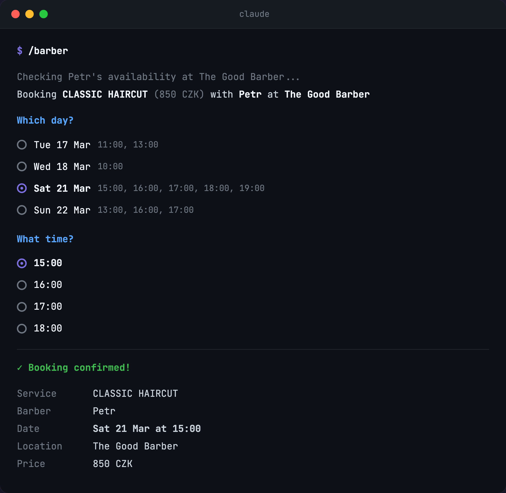

# noona-mcp

MCP server for the [Noona](https://noona.app) booking platform. Check availability, book appointments, and manage bookings at any Noona-powered business — barbershops, salons, massage parlors, restaurants, and more.

Uses the official [Noona Marketplace API](https://docs.noona.is/docs).

## Disclaimer

This is an **unofficial**, personal project. It is not affiliated with, endorsed by, or connected to Noona (Noona Labs ehf.) in any way.

- **For personal use only.** Do not use this to spam bookings, scrape data at scale, or interfere with the normal operation of the Noona platform.
- The Noona Marketplace API is publicly documented and does not require authentication for standard integrations. This tool uses only the official documented endpoints.
- **Use at your own risk.** The author is not responsible for any consequences of using this tool, including but not limited to: missed appointments, incorrect bookings, API changes, or ToS violations.

## Setup

### 1. Install

```bash
git clone https://github.com/matuspavliscak/noona-mcp.git
cd noona-mcp
npm install
```

### 2. Connect to your AI client

<details>
<summary><strong>Claude Desktop</strong></summary>

Open **Settings → Developer → Edit Config** (or edit `~/Library/Application Support/Claude/claude_desktop_config.json` on macOS / `%APPDATA%\Claude\claude_desktop_config.json` on Windows):

```json
{
  "mcpServers": {
    "noona": {
      "command": "node",
      "args": ["/absolute/path/to/noona-mcp/node_modules/.bin/tsx", "/absolute/path/to/noona-mcp/src/index.ts"]
    }
  }
}
```

> **Note:** Claude Desktop doesn't have `npx` in its PATH, so use the full path to `tsx` inside `node_modules`. Replace `/absolute/path/to/noona-mcp` with the actual path where you cloned the repo (e.g. `/Users/you/projects/noona-mcp`).

After saving, restart Claude Desktop. You should see a hammer icon with 6 tools available.

</details>

<details>
<summary><strong>Claude Code (CLI)</strong></summary>

Add to `~/.claude/mcp.json`:

```json
{
  "mcpServers": {
    "noona": {
      "command": "npx",
      "args": ["tsx", "/absolute/path/to/noona-mcp/src/index.ts"]
    }
  }
}
```

</details>

<details>
<summary><strong>Other MCP clients</strong></summary>

Any MCP-compatible client works. The server uses **stdio** transport. Run it with:

```bash
npx tsx /path/to/noona-mcp/src/index.ts
```

</details>

### 3. Set up contact info (for booking)

Create `~/.noona/config.json` with your booking details:

```bash
mkdir -p ~/.noona
cat > ~/.noona/config.json << 'EOF'
{
  "customerName": "Your Name",
  "customerPhone": "123456789",
  "phoneCountryCode": "420",
  "customerEmail": "your@email.com"
}
EOF
chmod 600 ~/.noona/config.json
```

The `book-appointment` tool reads this file automatically when contact fields are omitted. This keeps your personal info out of skill files, conversation history, and LLM context. The `chmod 600` ensures only your user can read it.

## Tools

| Tool | Description |
|------|-------------|
| `get-company-info` | Look up a Noona company or brand by URL/slug. Discovers locations for multi-branch businesses. |
| `get-availability` | Check available timeslots. Employee is optional. |
| `list-employees` | List all employees at a company. |
| `list-services` | List all services with prices. |
| `book-appointment` | Book an appointment (reserve + confirm). Contact fields optional if `~/.noona/config.json` exists. |
| `cancel-booking` | Cancel an existing booking by ID. |

> **Note:** Company, employee, and service data is cached in memory for 5 minutes to reduce API calls. If you've just made changes on the Noona side (e.g. added an employee or service), wait a few minutes or restart the MCP server to see updates.

## Usage

You can use the tools directly, or create a **Claude Code skill** for businesses you visit regularly.

### Direct usage

Just ask Claude:

> "Check availability at noona.app/mybarbershop"
>
> "Book me a haircut at mybarbershop tomorrow at 14:00"

### Creating a skill (recommended)

Tell Claude to set one up for you:

> "I'd like to create a new skill called /barber to book my appointments at https://noona.app/mybarbershop"

Claude will walk you through a guided setup, **one question at a time**:

1. **Location** — if the business has multiple branches, pick one as your default
2. **Service** — pick your go-to service from the list
3. **Barber/employee** — pick your favorite or say "no preference"
4. **Contact info** — name, phone, email — saved to `~/.noona/config.json` (not in the skill file)

The skill file (`~/.claude/skills/barber/SKILL.md`) stores only your preferences (location, service, employee) — no personal data. Contact info is read from `~/.noona/config.json` by the MCP server at booking time.

From then on, just say `/barber` and Claude shows availability for your preferred setup. Pick a time and you're booked.



You can create multiple skills — `/massage`, `/nails`, `/dentist` — each pointing to a different Noona business with your preferred settings. They all share the same `~/.noona/config.json` for contact info.

## Troubleshooting

### "Could not find a company or brand"

- Double-check the slug or URL — go to [noona.app](https://noona.app), search for the business, and copy the URL from the address bar.
- The Noona API might be temporarily unavailable. Try again in a few minutes.

### `tsx` not found

- Make sure you ran `npm install` in the project directory.
- For Claude Desktop, use the full path to `tsx` inside `node_modules` (see setup instructions above).

### Stale data (missing employees or services)

- The server caches company, employee, and service data for 5 minutes. Restart the MCP server to force a refresh.

### Booking fails with unclear error

- Ensure `~/.noona/config.json` exists and contains valid JSON with `customerName`, `customerPhone`, `phoneCountryCode`, and `customerEmail`.
- Check that the date format is `YYYY-MM-DD` and time format is `HH:MM`.

## License

MIT
